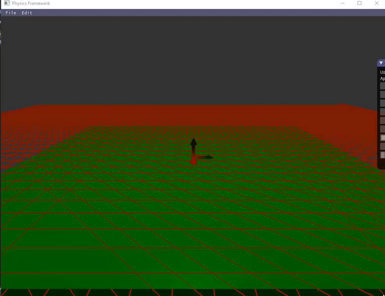
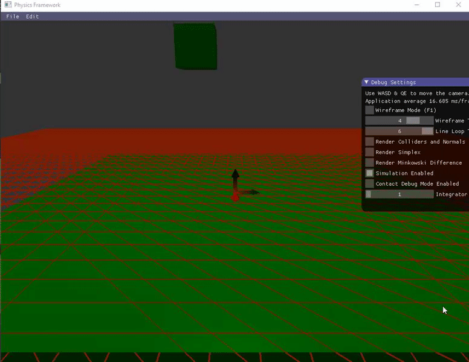

## System Design

The engine uses an Entity-Component system that communicates using an Observer pattern. Every object in the engine that wishes to listen to events must inherit from the interface/abstract base class `Observer`. `Subject` can have lists of type `Observer` who subscribe to and listen for events to occur in the future, as well as send one-time “fire and forget” events to `Object`. This allows for event-driven communication between `Observer` and `Object` objects (which most components in the engine are). All the managers in the engine derive from `Observer`, allowing them to listen to events from `GameObject`, `Engine`, and so on. The component hierarchy is fairly typical:

## Implementation of the Three Phases of Physics Simulation

### 1) Integration
By default, the engine uses a semi-implicit Euler integration method for dictating non-collision motion of rigid bodies. Both RK-4 and Velocity Verlet integrators were also implemented to account for some of the short-comings of Euler integration in certain scenarios (For more details, see [Integration Comparison](https://rj.romai.ro/arhiva/2013/2/Cioaca.pdf). 

#### Future Improvements
There are some caveats to integration such as where colliders that are marked as ‘Static’ are not integrated. This is an issue of poor component design where I require objects that don’t really need physics (namely static objects) to still own one as they contain some data that is necessary for collision detection. An improvement to this would be to decouple the Collider and Physics components dependencies so that a Collider could function without a Physics component also belonging to the owner.

Result of adding Integration mechanics:

### 2) Collision Detection
The Gilbert-Johnson-Keerthi (GJK) algorithm is a collision querier used to provide a boolean check for whether or not the two convex shapes that are being tested are intersecting. The strength of GJK, as opposed to other methods of intersection testing such as Chung-Wang (CW), is that it can be manipulated completely based on the type of support function and/or support map being used. Furthermore, since I didn't plan on implementing degenerate geometries to my engine, the slight performance boost of GJK has no noticable trade-off because the numerical instability that can arise with GJK is negligible for non-degenerate bodies. Originally, I was using the naïve method of looping through all vertices, getting the dot product of each vertex against the search direction, and finding the vertex furthest along that direction. However, for a shape with spatial symmetry about all three axes--i.e. squares and spheres--it is possible to use another method following an ‘Extent’ approach, which just multiplies the sign of the search direction against the half size of the cube (or the radius of the sphere). In this engine I only implemented cubes, so the above method was sufficient.

#### Expanding Polytope Algorithm (EPA)
If/when GJK finds a simplex that encloses the origin, it passes the simplex onto EPA, which attempts to locate the closest point possible to the origin in the Minkowski space. This should, in theory, give the contact point coordinates. In practice, due to the limitations of 32-bit floating point precision and math, EPA is very prone to numerical error. I began to see why when I encountered some situations whose blame falls squarely on the imprecision of EPA and its inability to return a consistent contact point or one that can be guaranteed to be close to the center of mass. It’s my belief that persistent manifolds are in fact a way to make up for the imprecision introduced by EPA into the resolution process, though also the issue of error in impulse solvers exacerbates this. When EPA returns a point that is within a tolerable limit of the origin, the contact point is extrapolated using barycentric projection. There is an iteration limit of 50 to prevent the EPA from cycling infinitely.

#### Future Improvements
I found a very interesting research paper after-the-fact detailing a new method for collision detection with improved convergence rate that also eliminates the need for a supplemental algorithm for obtaining contact information and constructing manifolds. The main idea is to replace Johnson's algorithm, the primary source of numerical instability in boolean GJK-EPA collision detection, with a new distance sub-algorithm called the Signed Volumes algorithm. This algorithm also replaces the need for EPA since part of its process is finding the point of a tetrahedron closest to the origin than any other point, which can be recorded for later use in collision resolution. For more details regarding accuracy/complexity analysis for the two algorithms, see [Collision Detection Comparison](https://ora.ox.ac.uk/objects/uuid:69c743d9-73de-4aff-8e6f-b4dd7c010907/download_file?safe_filename=GJK.PDF&file_format=application%2Fpdf&type_of_work=Journal+article).

Result of adding Collision Detection:

### 3) Collision Resolution
The contact that is generated by EPA is registered using a contact/collision constraint. This constraint is solved using a method given by Erin Catto in his paper “Iterative Dynamics using Temporal Coherence.” For more details, see [Collision Resolution](https://pdfs.semanticscholar.org/f8d6/8e78aa29a55bea61b5a1a05ba01c8886692e.pdf). It involves a sequential impulse method that comes down to a linear complementarity problem that must be solved using a numerical solver of some type. The type of solver used in the paper and in this engine is a projected Gauss-Siedel solver, which is shown to converge faster for my use-case than the Jacobi-Hamilton solver. The solver performs velocity correction to ensure that both the velocity-level constraint is satisfied and objects no longer move into each other. The penetration is resolved using a Baumgarte stabilization method, which massages the constraint forces to get them to do “virtual work." There is also a slop term that is provided on the Baumgarte stabilization to allow objects to penetrate a bit before we apply the Baumgarte term.

Result of adding Collision Resolution:

